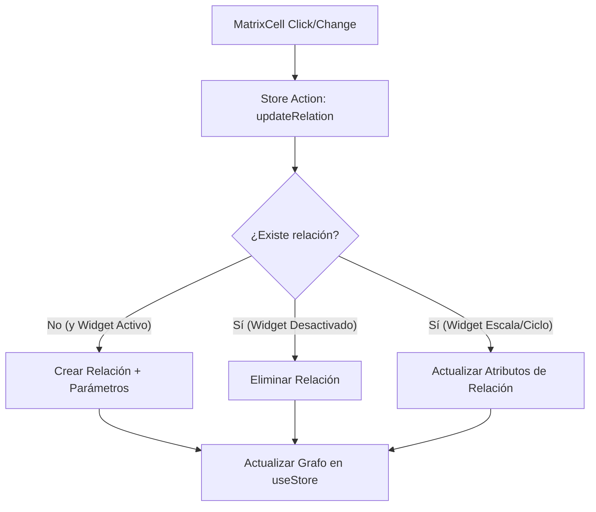

# Especificación Técnica: Relational Matrix View (iNNfo)

La **Relational Matrix View** (Vista de Matriz Relacional) es una herramienta de iNNfo diseñada para gestionar asociaciones muchos-a-muchos ($N$-a-$N$) entre nodos respetando su jerarquía y permitiendo la edición en caliente mediante celdas interactivas basadas en widgets parametrizables.

---

## 1. Arquitectura del Metamodelo (JSON)

Para soportar relaciones ricas y dinámicas, el metamodelo define la matriz y sus restricciones mediante una definición de asociación (`association_definition`) que configura el widget de edición y sus parámetros:

```json
{
  "name": "Problems-Value propositions Matrix",
  "source": "Problems",
  "target": "Value propositions",
  "association_definition": {
    "cardinality": "*..*",
    "widget": {
      "type": "scale",
      "params": {
        "min": 1,
        "max": 5,
        "step": 1,
        "labels": ["Bajo", "Moderado", "Alto", "Crítico"]
      }
    }
  }
}
```

---

## 2. Tipos de Intersecciones (Widgets en Celdas)

El comportamiento y la interfaz de la celda (`MatrixCell`) se determinan dinámicamente en base al tipo de widget y sus parámetros:

| Widget (`type`) | Parámetros Soportados (`params`) | Comportamiento en UI / Interacción |
| :--- | :--- | :--- |
| **`boolean`** | Ninguno (o valor por defecto) | Un checkbox o switch toggle. Crea o elimina la relación al hacer click. |
| **`cycle`** | `states: string[]`, `colors?: string[]` | Cambia cíclicamente de estado con cada click (ej: `pending` $\rightarrow$ `in_progress` $\rightarrow$ `completed`). |
| **`scale`** | `min: number`, `max: number`, `step: number`, `labels?: string[]` | Un control deslizante (slider) o selector numérico para cuantificar la intensidad de la relación. |
| **`set`** | `options: string[]`, `allow_custom?: boolean` | Un menú desplegable (dropdown) que permite seleccionar una o varias etiquetas de conexión. |

### Control de Propuestas de IA (Staged Changes)
Cualquier tipo de celda puede estar en estado de propuesta de IA. Visualmente se destaca con bordes punteados o degradados y controles rápidos para:
*   **Aceptar (`acceptAIChange`):** Consolida la relación propuesta en el modelo.
*   **Rechazar (`rejectAIChange`):** Descarta la sugerencia de la IA.

### Requisitos Adicionales de Interfaz
*   **REQ-4**: Las cabeceras de la cuadrícula (filas y columnas) DEBEN mostrar relaciones jerárquicas en formato de ruta o migas de pan (e.g., `Stakeholders > Segments > Profiles`).
*   **REQ-5**: Las celdas de intersección DEBEN renderizar los widgets interactivos correctos (`boolean`, `cycle`, `scale` o `set`) según la definición cargada.
*   **REQ-7**: Las propuestas de IA en celdas DEBEN tener un estilo visual diferenciado (borde discontinuo y fondo tenue de advertencia).
*   **REQ-8**: Las sugerencias propuestas DEBEN ofrecer acciones de Aceptar y Rechazar inline y en el panel lateral.
*   **REQ-9**: Al hacer clic en Aceptar, DEBE consolidarse el valor sugerido en el modelo de datos (`matrixValues`) y limpiarse el estado de propuesta.
*   **REQ-10**: Al hacer clic en Rechazar, DEBE descartarse la sugerencia conservando el valor previo del modelo.

---

## 3. Arquitectura del Flujo de Datos (`useStore`)

La interacción en la grilla se propaga al store global de React para persistir y actualizar el grafo de relaciones en tiempo real:



### Acciones del Store:
*   `toggleRelation(sourceId, targetId)`: Para widgets booleanos.
*   `updateRelationValue(sourceId, targetId, value)`: Para escalas, ciclos o selecciones, inyectando el valor/parámetro correspondiente.
*   `resolveAIProposal(sourceId, targetId, accept)`: Para consolidar o rechazar sugerencias de la IA.

---

## 4. Controles de la Barra de Herramientas (Toolbar Controls)
*   **REQ-1**: La barra de herramientas DEBEN incluir un selector de matrices para alternar dinámicamente entre las definiciones de matrices disponibles.
*   **REQ-2**: La barra de herramientas DEBE ofrecer un botón que desencadene una simulación de IA (cargando sugerencias de prueba).
*   **REQ-3**: La barra de herramientas DEBE poseer controles de anulación de parámetros (ej. control deslizante de umbral de confianza para filtrar las sugerencias propuestas).

---

## 5. Panel de Vista Previa Contextual (Contextual Preview Panel)
*   **REQ-6**: Al seleccionar cualquier celda, se DEBE abrir un panel lateral detallando la información de origen, destino y el estado actual de la intersección.

---

## 6. Escenarios de Validación

### Escenario 1: Mostrar detalles de la intersección
*   **Dado** que el usuario visualiza la Vista de Matriz Relacional.
*   **Cuando** hace clic en una celda de intersección entre un nodo origen y un nodo destino.
*   **Entonces** el panel lateral de vista previa contextual DEBE actualizarse mostrando metadatos de ambos nodos y su estado actual.

### Escenario 2: Cambiar el estado del widget a través de ciclos de clics
*   **Dado** un widget de tipo `cycle` en una celda con un estado determinado (ej: "Pending").
*   **Cuando** el usuario hace clic en el widget.
*   **Entonces** el valor del widget DEBE rotar al siguiente estado definido y actualizar su estilo de color asociado.

### Escenario 3: Resolver la sugerencia de simulación de IA
*   **Dado** que la simulación ha finalizado y se visualizan propuestas de IA resaltadas con bordes discontinuos.
*   **Cuando** el usuario acepta una propuesta.
*   **Entonces** el valor sugerido DEBE guardarse formalmente y retirarse la decoración visual de advertencia.
