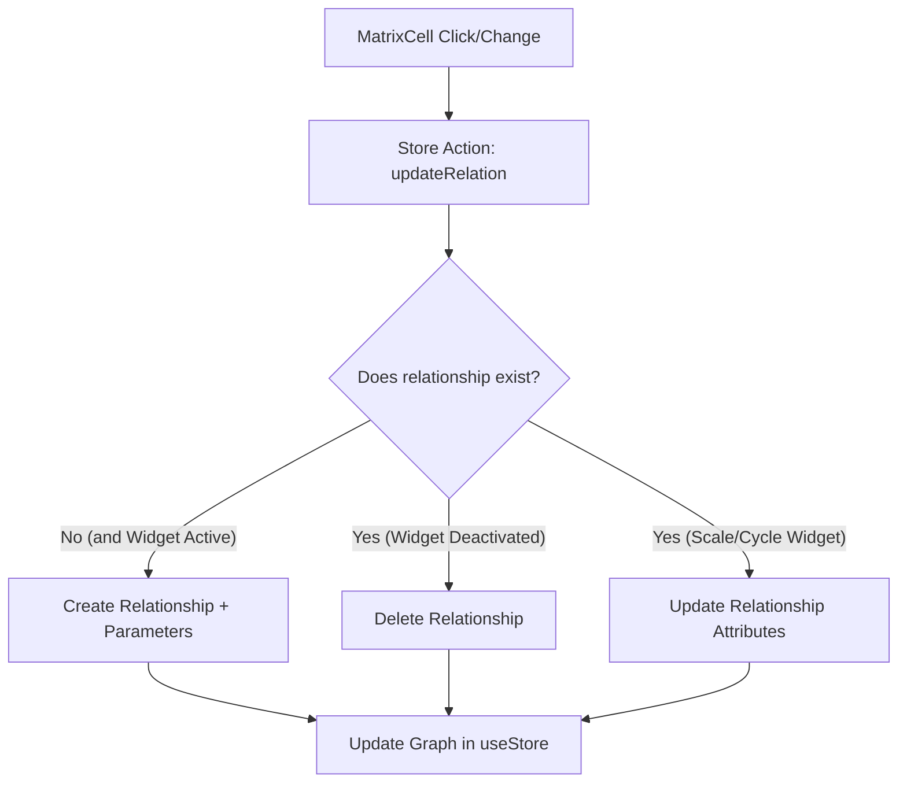

# Technical Specification: Relational Matrix View (FORMAT)

The **Relational Matrix View** is a FORMAT tool designed to manage many-to-many ($N$-to-$N$) associations between nodes, respecting their hierarchy and allowing on-the-fly editing via interactive cells powered by parameterizable widgets.

---

## 1. FORMAT Template Architecture (JSON)

To support rich and dynamic relations, the FORMAT template defines the matrix and its constraints using an association definition (`association_definition`) that configures the editing widget and its parameters:

```json
{
  "name": "Problems-Value propositions Matrix",
  "source": "Problems",
  "target": "Value propositions",
  "association_definition": {
    "cardinality": "*..*",
    "widget": {
      "type": "scale",
      "params": {
        "min": 1,
        "max": 5,
        "step": 1,
        "labels": ["Low", "Moderate", "High", "Critical"]
      }
    }
  }
}
```

---

## 2. Intersection Types (Cell Widgets)

The behavior and interface of the cell (`MatrixCell`) are dynamically determined based on the widget type and its parameters:

| Widget (`type`) | Supported Parameters (`params`) | UI Behavior / Interaction |
| :--- | :--- | :--- |
| **`boolean`** | None (or default value) | A checkbox or switch toggle. Creates or deletes the relationship when clicked. |
| **`cycle`** | `states: string[]`, `colors?: string[]` | Cyclically changes state with each click (e.g., `pending` $\rightarrow$ `in_progress` $\rightarrow$ `completed`). |
| **`scale`** | `min: number`, `max: number`, `step: number`, `labels?: string[]` | A slider or numeric input to quantify the relationship intensity. |
| **`set`** | `options: string[]`, `allow_custom?: boolean` | A dropdown menu allowing the selection of one or more connection tags. |

### AI Proposal Control (Staged Changes)
Any cell type can be in an AI proposal state. Visually, it is highlighted with dashed or gradient borders and quick controls to:
*   **Accept (`acceptAIChange`):** Commits the proposed relationship to the model.
*   **Reject (`rejectAIChange`):** Discards the AI suggestion.

### Additional Interface Requirements
*   **REQ-4**: Grid headers (rows and columns) MUST show hierarchical relationships in a path or breadcrumb format (e.g., `Stakeholders > Segments > Profiles`).
*   **REQ-5**: Intersection cells MUST render the correct interactive widgets (`boolean`, `cycle`, `scale`, or `set`) according to the loaded definition.
*   **REQ-7**: AI proposals in cells MUST have a distinct visual style (dashed border and faint warning background).
*   **REQ-8**: Proposed suggestions MUST offer Accept and Reject actions inline and in the sidebar.
*   **REQ-9**: Clicking Accept MUST commit the suggested value to the data model (`matrixValues`) and clear the proposal state.
*   **REQ-10**: Clicking Reject MUST discard the suggestion, retaining the model's previous value.

---

## 3. Data Flow Architecture (`useStore`)

The grid interaction propagates to the global store to persist and update the relationship graph in real time:



### Store Actions:
*   `toggleRelation(sourceId, targetId)`: For boolean widgets.
*   `updateRelationValue(sourceId, targetId, value)`: For scales, cycles, or selections, injecting the corresponding value/parameter.
*   `resolveAIProposal(sourceId, targetId, accept)`: To commit or reject AI suggestions.

---

## 4. Toolbar Controls
*   **REQ-1**: The toolbar MUST include a matrix selector to dynamically switch between available matrix definitions.
*   **REQ-2**: The toolbar MUST offer a button to trigger an AI simulation (loading test suggestions).
*   **REQ-3**: The toolbar MUST have parameter override controls (e.g., confidence threshold slider to filter proposed suggestions).

---

## 5. Contextual Preview Panel
*   **REQ-6**: Selecting any cell MUST open a sidebar detailing the source, target, and current state of the intersection.

---

## 6. Validation Scenarios

### Scenario 1: Show intersection details
*   **Given** the user is viewing the Relational Matrix View.
*   **When** they click on an intersection cell between a source node and a target node.
*   **Then** the contextual preview sidebar MUST update, displaying metadata for both nodes and their current state.

### Scenario 2: Rotate widget state via click cycles
*   **Given** a `cycle` widget type in a cell with a specific state (e.g., "Pending").
*   **When** the user clicks the widget.
*   **Then** the widget value MUST rotate to the next defined state and update its associated color style.

### Scenario 3: Resolve AI simulation suggestion
*   **Given** the simulation has completed and AI proposals are highlighted with dashed borders.
*   **When** the user accepts a proposal.
*   **Then** the suggested value MUST be formally saved and the warning visual decoration removed.
