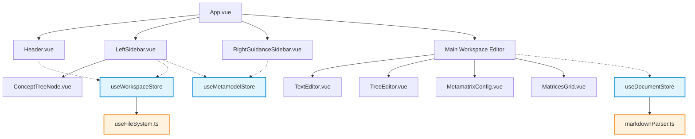
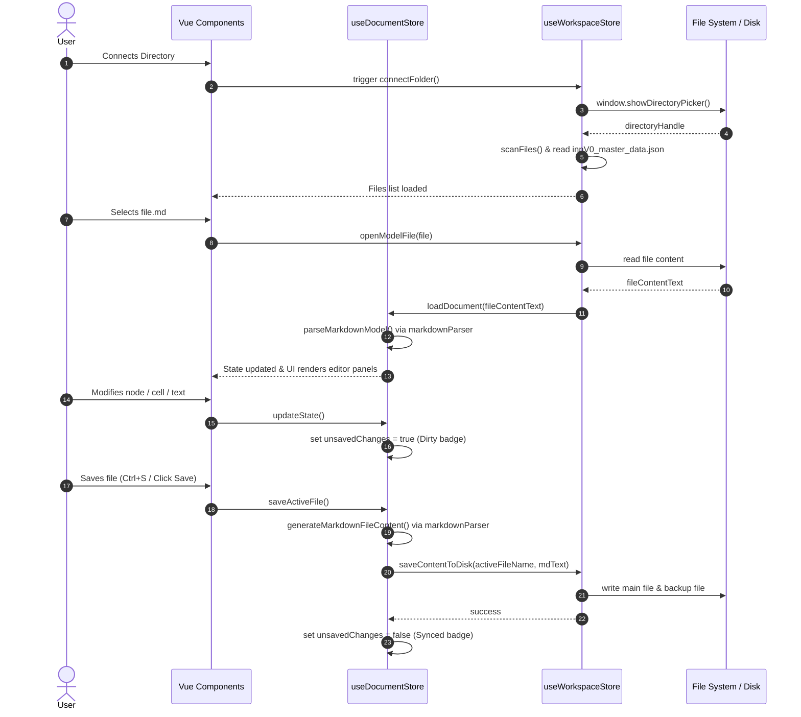

# Technical Design: innV0 Business Modeler Modularization

This document outlines the technical design, architectural approach, and migration plan for refactoring the monolithic, single-file `index.html` application of the innV0 Business Modeler into a modern, type-safe, and modular Vite + Vue 3 + TypeScript + Tailwind CSS + shadcn-vue application.

---

## 1. Technical Approach

The modularized application will be built using the following modern frontend stack:
*   **Build Tool**: **Vite** (v5) for fast development startup, HMR (Hot Module Replacement), and optimized production bundler (Rollup).
*   **Frontend Framework**: **Vue 3** (Composition API, `<script setup>` syntax) for high-performance reactivity and component-driven architecture.
*   **Language**: **TypeScript** (v5) to enforce type safety across metamodel definitions, hierarchical trees, matrix states, and parser operations.
*   **State Management**: **Pinia** (v2) for centralized, reactive state management (replacing the root instance's monolithic reactive properties).
*   **Styling**: **Tailwind CSS** (v3) with **shadcn-vue** (primitives built on top of **Radix Vue** and **Lucide Vue Next**) to build standardized, accessible, and clean UI components (tables, inputs, selects, cards).
*   **Testing**: **Vitest** for unit testing the markdown parser and serializer logic, ensuring 100% behavioral and data parity with the legacy version.

---

## 2. Architectural Decisions



### 2.1 State Management (Pinia Stores)
We decompose the monolithic reactive state into three Pinia stores:
1.  **`useWorkspaceStore`**: Manages the connected directory handle, files list, active file handle/name, and workspace status (Demo Mode vs. Synced vs. Unsaved).
2.  **`useMetamodelStore`**: Handles metamodel definitions (concepts, markers, and matrix templates). It is responsible for loading `innV0_master_data.json` from the workspace or falling back to the built-in default configuration.
3.  **`useDocumentStore`**: Holds the current active document state (model text entries, the model hierarchy tree, active node selections, node markers, metamatrix configurations, and matrix cell values). It contains actions to parse markdown contents, check dirty states, and serialize state back into Markdown.

### 2.2 Composables & Hooks
*   **`useFileSystem`**: Abstracts the browser's File System Access API. Handles directory picking, recursive `.md` file tree discovery (excluding `node_modules` and `backups`), file reading, and saving (including generating backup files inside `backups/`).

### 2.3 Pure Utility Services
*   **`markdownParser.ts`**: A stateless, fully tested module containing the parsing and serialization logic. 
    *   **Parsing**: Reads the frontmatter and splits the Markdown by `# ` headers. Rebuilds `modelTree` from hierarchy matrices, extracts markers, maps metamatrix definitions, maps cell values from dynamic matrices, and saves remaining items as raw text concepts.
    *   **Serialization**: Generates frontmatter, text concepts, generates auto-calculated hierarchy tables matching the active `modelTree` (rebuilding Stakeholders, Segments, Profiles, and Personas lists), creates the `# Item-Markers Matrix`, creates the `# Metamatrix` definition block, and appends all active relational matrices as Markdown tables.

---

## 3. Data Flow

The flow of data during typical operations follows a strict unidirectional cycle:



---

## 4. Types Definition (`src/types/index.ts`)

```typescript
export interface Concept {
  name: string;
  category_id: string | null;
  emoji: string;
  type: 'text' | 'category' | 'weight' | 'steps' | 'sequence' | null;
  description: string | null;
}

export interface Marker {
  name: string;
  symbol: string;
  emoji: string;
  description: string;
}

export interface MetamatrixRow {
  name: string;
  source: string;
  target: string;
  widgetType: 'boolean' | 'cycle' | 'scale' | 'set';
  params: string;
}

export interface TreeNode {
  id: string;
  name: string;
  type: 'Stakeholders' | 'Segments' | 'Profiles' | 'Persona';
  description: string;
  children: TreeNode[];
}

export interface NodeMarkers {
  [nodeId: string]: {
    [markerName: string]: number; // score 1-3
  };
}

export interface MatrixValues {
  [cellKey: string]: string | number | boolean; // key format: "MatrixName||Row||Col"
}

export interface FileItem {
  name: string;
  handle: FileSystemFileHandle;
}
```

---

## 5. File Changes Mapping

### 5.1 Project Scaffolding Structure (Vite entry points)
*   **`index.html`**: Cleaned up. CDNs replaced by local imports. The body contains only the `<div id="app"></div>` and targets the script `<script type="module" src="/src/main.ts"></script>`.
*   **`package.json`**: New production dependencies (`vue`, `pinia`, `lucide-vue-next`, `radix-vue`, `clsx`, `tailwind-merge`) and development tools (`vite`, `vitest`, `typescript`, `@vitejs/plugin-vue`, `tailwindcss`, `postcss`, `autoprefixer`).
*   **`tsconfig.json`** & **`vite.config.ts`**: Setup TypeScript compiling and path aliases (e.g. `@/*` maps to `./src/*`).

### 5.2 Application Files to Create
```text
src/
├── assets/
│   └── index.css                   # Tailwind CSS directives & custom Inter font setup
├── types/
│   └── index.ts                    # TypeScript Interfaces (section 4)
├── utils/
│   └── markdownParser.ts           # Pure Markdown parser/serializer (section 2.3)
├── composables/
│   └── useFileSystem.ts            # File System Access API hook
├── stores/
│   ├── workspace.ts                # Pinia store for directory connectivity and files
│   ├── metamodel.ts                # Pinia store for innV0_master_data.json handling
│   └── document.ts                 # Pinia store for open document values and tree
├── components/
│   ├── layout/
│   │   ├── Header.vue              # Top nav, sync status, connect directory buttons
│   │   ├── LeftSidebar.vue         # Metamodel load status, workspace file list
│   │   ├── RightGuidanceSidebar.vue# Contextual guidance, methodologies markdown, prompts
│   │   └── ConceptTreeNode.vue     # Sidebar recursive section navigator
│   ├── editor/
│   │   ├── TextEditor.vue          # Markdown text inputs and preview
│   │   ├── TreeEditor.vue          # Interactive hierarchical tree editor with markers
│   │   ├── MetamatrixConfig.vue    # Relational matrices configurations definition
│   │   └── MatricesGrid.vue        # Rendered relational matrix grid inputs
│   └── ui/
│       └── [shadcn-vue components] # Button, Dropdown, Table, Input, Textarea, Card
├── App.vue                         # Main layout structure linking all layouts and editors
└── main.ts                         # App bootsrapper
```

---

## 6. Testing Strategy

To guarantee **100% data and behavior parity**, we will write automated parser tests using `vitest`.

### 6.1 Parser Parity Tests (`tests/markdownParser.test.ts`)
*   **Roundtrip Verification Test**:
    1.  Load raw sample model markdown files (e.g. from the `Samples/` folder) into the test runner.
    2.  Run `parseMarkdownModel` to populate state objects.
    3.  Pass the parsed state directly back to `generateMarkdownFileContent`.
    4.  Assert that the generated markdown matches the input file exactly (excluding the `last_saved` timestamp).
*   **Tree Rebuilding Test**:
    *   Verify that nested hierarchies are parsed correctly: `Stakeholder -> Segment -> Profile -> Persona` must restore the proper parent-child relations from matrix table rows containing `X` markers.
*   **Markers parsing Test**:
    *   Ensure numeric values inside `# Item-Markers Matrix` populate the markers state accurately, and missing scores default to `0`.
*   **Dynamic Matrix config and cell value Test**:
    *   Ensure dynamic matrix definitions are mapped to the widgets configuration, and cell values containing strings, cycles, and scales match their source inputs.
