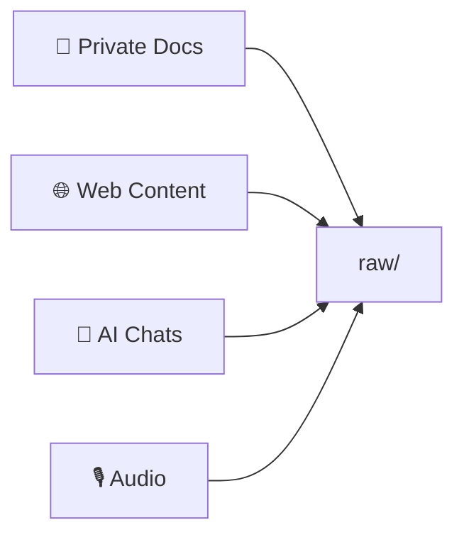
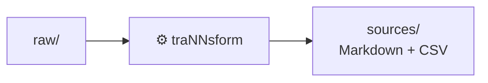
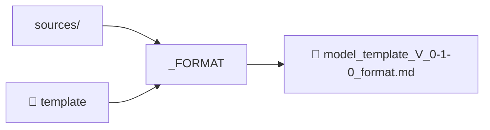
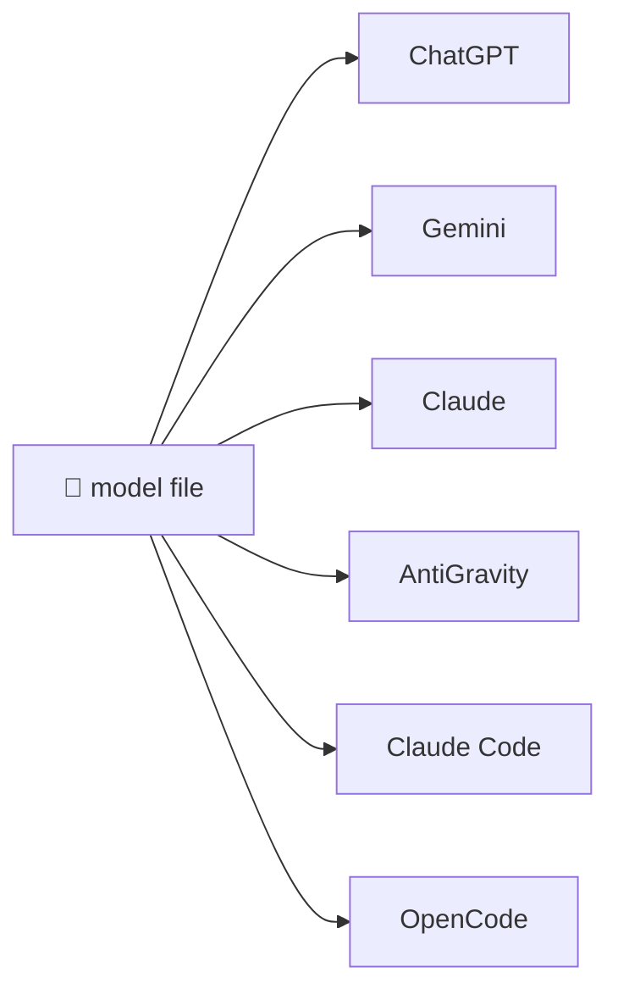

# _FORMAT
**F****** Omnipotent Readable Model Annotated Template**

## One file. Your entire business — finally ready for AI.

_FORMAT reads a single structured `.md` file that holds your complete business strategy:
segments, problems, value propositions, roadmap, finances, team — all interconnected.
Drop it as context into any AI model or agent and get strategic answers. Commit it to Git and get a living, visual, version-controlled business model.

[Try it free →](#format) [Read the spec →](#format)

<div class="template-cards">
  <a href="#business" class="template-card">
    <div>
      <strong>Business Template</strong>
      <span>70+ concepts · 13 matrices · 5 markers — model your entire business strategy in one file</span>
    </div>
  </a>
  <a href="#procedures" class="template-card">
    <div>
      <strong>Procedures Template</strong>
      <span>3 concepts · 1 marker — document workflows and standard operating procedures</span>
    </div>
  </a>
</div>

---

<div class="demo-split">
  <div class="demo-col demo-source">
    <div class="demo-label">your <code>.md</code> file</div>
    <pre class="demo-code"><span class="dm-comment"># &lt;!-- block: concepts --&gt; problems</span>

<span class="dm-bullet">*</span> <span class="dm-item">AI has no business context</span>
  Every conversation resets.
  Generic answers only.

<span class="dm-bullet">*</span> <span class="dm-item">Info scattered in 30 files</span>
  No single source of truth
  for strategy or AI.

<span class="dm-bullet">*</span> <span class="dm-item">Static business models</span>
  Plans obsolete the moment
  they're saved.

<span class="dm-comment"># &lt;!-- block: concepts --&gt; value propositions</span>

<span class="dm-bullet">*</span> <span class="dm-item">Instant AI context</span>
<span class="dm-bullet">*</span> <span class="dm-item">Version-controlled models</span>
<span class="dm-bullet">*</span> <span class="dm-item">Automated coherence</span></pre>
  </div>
  <div class="demo-arrow">
    <div class="demo-arrow-line"></div>
    <svg width="32" height="32" viewBox="0 0 24 24" fill="none" xmlns="http://www.w3.org/2000/svg"><path d="M5 12h14M13 6l6 6-6 6" stroke="currentColor" stroke-width="2" stroke-linecap="round" stroke-linejoin="round"/></svg>
    <span>_FORMAT</span>
  </div>
  <div class="demo-col demo-visual">
    <div class="demo-label">interactive visual model</div>
    <div class="demo-ui">
      <div class="ui-concept">
        <div class="ui-concept-header">
          <span class="ui-emoji">😟</span>
          <span class="ui-name">Problems</span>
          <span class="ui-count">3</span>
        </div>
        <div class="ui-elements">
          <div class="ui-element"><span>🤖</span> AI has no business context <span class="ui-score high">●●●●●</span></div>
          <div class="ui-element"><span>📂</span> Info scattered in 30 files <span class="ui-score high">●●●●●</span></div>
          <div class="ui-element"><span>📄</span> Static business models <span class="ui-score high">●●●●○</span></div>
        </div>
      </div>
      <div class="ui-matrix">
        <div class="ui-matrix-label">problems × value propositions</div>
        <table class="ui-matrix-table">
          <thead><tr><th></th><th>AI Context</th><th>Versioned</th><th>Traceab.</th></tr></thead>
          <tbody>
            <tr><td>AI context gap</td><td class="cell-max">Max</td><td class="cell-max">Max</td><td class="cell-max">Max</td></tr>
            <tr><td>Scattered info</td><td class="cell-max">Max</td><td class="cell-high">High</td><td class="cell-max">Max</td></tr>
            <tr><td>Static models</td><td class="cell-high">High</td><td class="cell-neu">—</td><td class="cell-high">High</td></tr>
          </tbody>
        </table>
      </div>
    </div>
  </div>
</div>

---

## The AI problem nobody talks about

You use AI every day. But how much time do you spend explaining your business *every single time*?

Who are your customers. What problems you solve. What your product does. How you make money.
Over and over. In every conversation. Starting from zero.

That's not an AI limitation — it's a context problem.
**Your business information is scattered across 30 different files that no AI can read coherently.**

*"Companies don't die from lack of ideas. They die from strategic incoherence — and from AI that can't help because it doesn't know the whole picture."*

---

## One file changes everything

A _FORMAT file is a single, structured `.md` document that holds your **complete business context**:
every segment, problem, value proposition, channel, metric, team member, and financial projection —
all interconnected through relational matrices.

Drop it into any AI conversation as context. Claude, GPT, Gemini — they all instantly know your entire business.
No more generic answers. No more starting over. Strategic depth, every time.

---

## How it works

1. **Connect** your local repository to the _FORMAT editor
2. **Declare** your stakeholders, problems, and value propositions in plain Markdown
3. **Map** bidirectional relationships in matrix tables
4. **Validate** — AI and logic engine deliver a coherence report with scores
5. **Save** directly to your repo — and use the file as AI context in any conversation

---

## Information Pipeline

How raw knowledge becomes AI-ready business context:

<div class="pipeline-steps">

<div class="pipeline-step">
<h3>Collect sources into raw/</h3>
<p>Private documents, internet content, AI conversations, and audio recordings — in any format (Excel, PowerPoint, Word, text, PDF) — are gathered into a single <code>raw/</code> folder.</p>


</div>

<div class="pipeline-step">
<h3>Convert with traNNsform</h3>
<p>The <code>traNNsform</code> tool reads every file in <code>raw/</code> and normalizes it into structured Markdown and CSV.</p>


</div>

<div class="pipeline-step">
<h3>Generate the model with _FORMAT</h3>
<p>_FORMAT reads all files in <code>sources/</code>, applies the template, and produces a single self-contained business model file.</p>


</div>

<div class="pipeline-step">
<h3>Query any AI model or agent</h3>
<p>Drop the generated file into ChatGPT, Gemini, Claude, or any AI agent — AntiGravity, Claude Code, OpenCode — as context. The AI instantly knows your entire business — no re-explaining needed.</p>


</div>

</div>

---

## Built for serious teams

### Startup Founders
One _FORMAT file = instant AI co-founder. Ask Claude or GPT to review your go-to-market,
validate your pricing, or identify the weakest link in your model — with full business context.
Plus: keep strategy and product roadmap in sync from day one with Git versioning.

### Strategy Consultants
Manage 8 client models simultaneously — each as a structured file with complete business context.
Drop any client file into an AI session and get deep analysis without explaining the business every time.
Deliver coherence reports backed by relational matrix scoring, not gut feeling.

### Product Managers
Use your _FORMAT file as AI context to ask: *"Does this feature address a validated customer problem?"*
Trace every roadmap decision back to real customer pain — with matrix-level traceability.
No more strategy-execution disconnects.

### Investors
Evaluate startup business models with structural coherence scoring, not slide decks.
Each _FORMAT file is a machine-readable, auditable view of the full business hypothesis —
objective, reproducible, and comparable across portfolio companies.

---

## Three ways to use _FORMAT

### Open Source Engine · Free
Local Markdown parser and graph renderer. No account required. Works offline.
The entire spec is open — fork it, extend it, build on it.

### _FORMAT Cloud · Team collaboration
Real-time collaborative editing, full Git history, advanced AI audits,
repository integrations, and export to PDF and presentation formats.

### Enterprise Suite · Full control
On-premise deployment, access control, regulatory audit trails,
custom metamodels, and dedicated support.

[Get started →](#) · [Contact us →](mailto:lucas@lucascervera.com)

---

## Built on open standards — designed for the AI era

_FORMAT uses no proprietary formats. Every file is a valid Markdown document
readable without any tool — by humans and AI models alike.

- **Markdown** — human-readable, no lock-in, pasteable as AI context in any tool
- **YAML frontmatter** — machine-readable schema definition for structured AI parsing
- **Git-native** — diff, branch, and PR your strategy like code
- **AI-ready** — designed from the ground up for LLM context injection and generation
- **Single source of truth** — one file, complete business knowledge, zero context fragmentation

[Read the full specification →](#format) · [View on GitHub →](https://github.com/innV0/FORMAT)

---

# <!-- block: concepts --> <a id="format"></a>_FORMAT Specification
**F****** Omnipotent Readable Model Annotated Template**

## The format that powers it all

_FORMAT is a plain-text specification that lives in your Git repository alongside your code.
Write your business model in Markdown. _FORMAT renders the rest.

### Instant AI context — the real superpower
One file holds your complete, structured business knowledge.
Paste it into any AI model or agent — ChatGPT, Gemini, Claude, AntiGravity, Claude Code, OpenCode — and ask real strategic questions:
*"Which customer segment has the weakest value proposition alignment?"*
*"What's the biggest coherence gap between our roadmap and our problems?"*
The AI knows your entire business. It answers with precision, not generalities.

### Version-controlled living models
Your strategy evolves as pull requests. Every change is tracked, diffable, and reversible.
Strategic PRs are now a real thing.

### Automated coherence validation
An AI and logic engine scores the consistency between your problems, value propositions,
features, and metrics. You see exactly where the model breaks down — before you build the wrong thing.

### Complete strategic traceability
Every dimension — team, finance, roadmap, customer problems — is connected in a
multidimensional relational graph. No more silos between strategy and execution.

---

## What happens when AI knows your whole business

**Without _FORMAT** — every conversation resets:
> *"My startup helps B2B SaaS companies with onboarding... we have two customer segments... our main problem is..."*
> Generic advice. Wasted time. Shallow answers.

**With _FORMAT** — paste the file, ask the real question:
> *"Based on our business model, which value proposition has the weakest coverage for the Consulting Firms segment, and what features should we prioritize?"*
> Deep, specific, actionable. Because the AI has full context.

---

## Document structure

Every _FORMAT file is a single UTF-8 document with two parts:

**1. YAML Frontmatter** — the Template schema, versioning, and metadata:

```yaml
specification_version: "V_0-1-2"
specification_url: "https://raw.githubusercontent.com/innV0/FORMAT/v0.1.2/DOCS/spec/V_0-1-2/spec.md"
title: "My Business Model"
template:
  name: "business"
  version: "V_1-0-0"
  concepts:
    - name: "problems"
      type: "weight"
    - name: "value propositions"
      type: "weight"
  markers:
    - name: "weight"
      symbol: "*"
  matrices:
    - name: "problems-value propositions matrix"
      source: "problems"
      target: "value propositions"
```

**2. Markdown Body** — concept blocks and matrices:
```markdown
# <!-- block: concepts --> problems

* <!-- block: problems --> High customer churn
  Retention below 60% after 3 months.

* <!-- block: problems --> Weak onboarding
  Users don't reach activation in first week.

# <!-- block: matrices --> problems-value propositions matrix

| problems \ value propositions | Better Onboarding | Retention Program |
| :--- | :---: | :---: |
| **High customer churn** | High | Max |
| **Weak onboarding** | Max | - |
```

---

## Key concepts

| Concept | Description |
| :--- | :--- |
| **Template** | The schema defining allowed concepts, markers, and matrices |
| **Concept** | A category of information (e.g. `problems`, `value propositions`) |
| **Element** | An instance of a concept (e.g. "High customer churn" is an element of `problems`) |
| **Marker** | An evaluative tag applied to elements (weight, completion, certainty, priority, rating) |
| **Matrix** | A table expressing relationships between elements |
| **Field** | Custom key-value properties on elements (age, fears, department) |

---

## Specification versions

| Version | Status | Link |
| :--- | :--- | :--- |
| **V_0-1-2** | Current | [_format.md](https://raw.githubusercontent.com/innV0/FORMAT/main/DOCS/V_0-1-2/_format.md) |
| **V_0-1-1** | Stable | [format-spec.md](https://raw.githubusercontent.com/innV0/FORMAT/v0.1.1/DOCS/spec/V_0-1-1/format-spec.md) |
| **V_0-1-0** | Legacy | [format-spec.md](https://raw.githubusercontent.com/innV0/FORMAT/v0.1.0/DOCS/spec/V_0-1-0/format-spec.md) |

[Read the full specification →](https://raw.githubusercontent.com/innV0/FORMAT/main/DOCS/V_0-1-2/_format.md)

---

# <!-- block: concepts --> <a id="business"></a>Business Template

## Model your entire business in one file

The Business Template is the default _FORMAT template for modeling complete business strategies.
With **70+ concepts**, **13 relational matrices**, and **5 evaluation markers**, it covers every dimension of a business — from market analysis to financial projections.

### Who it's for

- **Startup Founders** — validate your go-to-market with AI that knows your whole model
- **Strategy Consultants** — manage multiple client models with structural coherence scoring
- **Product Managers** — trace every feature back to validated customer problems
- **Investors** — evaluate business hypotheses with machine-readable, auditable models

---

## Template structure

The Business Template organizes concepts into **8 categories**:

| Category | Key Concepts | Focus |
| :--- | :--- | :--- |
| **Market** | Stakeholders, Segments, Profiles, Persona, Segmentation, Competition | Who you serve and why |
| **Solutions** | Products & Services, Portfolio, Components, Features, Roadmap | What you offer |
| **Marketing** | Naming, Branding, Visual Identity, Logo, Media Plan | How you present |
| **Communication** | Pitch, Brochure, Web, Storytelling, Presentations | How you communicate |
| **Organization** | Business Idea, Inspiration, Opportunity, Business Status | Why you exist |
| **Business Objectives** | Mission, Vision, Values, Goals | Where you're going |
| **Operations** | Activities, Functions, Resources | How you operate |
| **Finance** | Revenue, Costs, CAC, LTV, Unit Economics, Funding, Projections | How you make money |

Plus **Analysis** (Assumptions, Risks, SWOT) and **Validation** (Coherence, Experiments).

---

## Relational matrices

The Business Template defines **13 matrices** that map relationships between concepts:

| Matrix | Source → Target | Purpose |
| :--- | :--- | :--- |
| Journey map | Journey → Emotions | Map emotional journey stages |
| Segmentation-Profiles | Segmentation → Profiles | Link criteria to profiles |
| Problems-Value propositions | Problems → Value propositions | Core value alignment |
| Value propositions-Messages | Value propositions → Messages | Communication strategy |
| Messages-Channels | Messages → Channels | Distribution strategy |
| Assumptions-Risks | Assumptions → Risks | Risk validation |
| Experiments-Assumptions | Experiments → Assumptions | Hypothesis testing |
| Metrics-Organizational goals | Metrics → Goals | OKR alignment |
| Features-Milestones | Features → Milestones | Product roadmap |
| Org values-Goals | Values → Goals | Culture alignment |
| Functions-Positions | Functions → Positions | Team structure |
| Activities-Resources | Activities → Resources | Operational capacity |
| Problems-Competition | Problems → Competition | Competitive landscape |

---

## Evaluation markers

Every element can be scored with **5 markers**:

| Marker | Symbol | What it measures |
| :--- | :--- | :--- |
| **Weight** | `*` | Importance to the business model |
| **Completion** | `>` | How finished or stable it is |
| **Certainty** | `?` | Level of validation or assumption |
| **Priority** | `!` | Urgency and action ranking |
| **Rating** | `+` | Strengths and weaknesses |

---

## Example: problems-value propositions matrix

```markdown
| problems \ value propositions | AI Context | Versioned | Traceability |
| :--- | :---: | :---: | :---: |
| **Info scattered in 30 files** | Max | High | Max |
| **AI has no business context** | Max | Max | Max |
| **Static business models** | High | - | High |
```

This matrix reveals which value propositions solve which problems — and where the gaps are.

---

## Links

| Resource | Link |
| :--- | :--- |
| Template spec (V_1-0-0) | [template.md](https://raw.githubusercontent.com/innV0/FORMAT/main/DOCS/templates/business/V_1-0-0/template.md) |
| Full documentation | [documentation.md](https://raw.githubusercontent.com/innV0/FORMAT/main/DOCS/templates/business/V_1-0-0/documentation.md) |
| GitHub directory | [DOCS/templates/business/V_1-0-0/](https://github.com/innV0/FORMAT/tree/main/DOCS/templates/business/V_1-0-0) |
| _FORMAT spec (V_0-1-2) | [_format.md](https://raw.githubusercontent.com/innV0/FORMAT/main/DOCS/V_0-1-2/_format.md) |

---

# <!-- block: concepts --> <a id="procedures"></a>Procedures Template

## Document your workflows, step by step

The Procedures Template is a lightweight _FORMAT template for documenting processes, workflows, and standard operating procedures.
It's designed for teams that need to capture **how things get done** — with clarity, structure, and AI-readability.

### Who it's for

- **Ops Teams** — standardize recurring processes with clear roles and steps
- **Engineering Leads** — document deployment pipelines, code review workflows, incident response
- **Compliance** — create auditable procedure records with traceable steps
- **Any team** — turn tribal knowledge into structured, version-controlled documentation

---

## Template structure

The Procedures Template is intentionally simple — **3 concepts, 1 marker, 0 matrices**:

| Concept | Type | Description |
| :--- | :--- | :--- |
| **Procedure Summary** | `text` | Brief explanation of the procedure's goals and scope |
| **Roles Involved** | `category` | The actors/roles that participate in the procedure |
| **Steps** | `steps` | Ordered steps required to complete the procedure |

### Marker

| Marker | Description |
| :--- | :--- |
| **Complexity** | How complex is the procedure to execute (1–5 scale) |

---

## Example: deployment procedure

```yaml
specification_version: "V_0-1-2"
template:
  name: "procedures"
  version: "V_1-0-0"
title: "Production Deployment Procedure"
```

```markdown
# <!-- block: concepts --> procedure summary

Standard workflow for deploying software changes to production.
Ensures code quality, security, and traceability through a controlled release process.

# <!-- block: concepts --> roles involved

* <!-- block: roles involved --> Developer
  Writes code, addresses review feedback, executes deployments.

* <!-- block: roles involved --> Tech Lead
  Conducts code reviews and authorizes production deployments.

* <!-- block: roles involved --> QA Engineer
  Validates test cases and performance thresholds.

* <!-- block: roles involved --> Release Manager
  Coordinates deployment schedule and communicates status.

# <!-- block: concepts --> steps

1. <!-- block: steps --> Code Review
   - description: Tech Lead reviews merge request for quality and risks.
   - duration: 2 hours

2. <!-- block: steps --> QA Validation
   - description: QA Engineer runs automated tests and manual validation.
   - duration: 4 hours

3. <!-- block: steps --> Security Scan
   - description: Automated scan identifies vulnerabilities.
   - duration: 1 hour

4. <!-- block: steps --> Deployment Approval
   - description: Release Manager reviews all gates and authorizes release.
   - duration: 30 minutes

5. <!-- block: steps --> Production Deploy
   - description: Developer executes deployment, monitors rollout, verifies health.
   - duration: 1 hour

6. <!-- block: steps --> Post-Deploy Verification
   - description: QA Engineer runs smoke tests in production.
   - duration: 1 hour
```

---

## When to use Business vs Procedures

| Use Case | Template |
| :--- | :--- |
| Modeling market strategy, value propositions, finances | **Business** |
| Documenting a deployment workflow | **Procedures** |
| Validating product-market fit with matrices | **Business** |
| Creating an onboarding checklist | **Procedures** |
| Analyzing competitive landscape | **Business** |
| Standardizing code review process | **Procedures** |

Both templates use the same _FORMAT specification — they're just different schemas for different purposes.

---

## Links

| Resource | Link |
| :--- | :--- |
| Template spec (V_1-0-0) | [template.md](https://raw.githubusercontent.com/innV0/FORMAT/main/DOCS/templates/procedures/V_1-0-0/template.md) |
| GitHub directory | [DOCS/templates/procedures/V_1-0-0/](https://github.com/innV0/FORMAT/tree/main/DOCS/templates/procedures/V_1-0-0) |
| _FORMAT spec (V_0-1-2) | [_format.md](https://raw.githubusercontent.com/innV0/FORMAT/main/DOCS/V_0-1-2/_format.md) |
